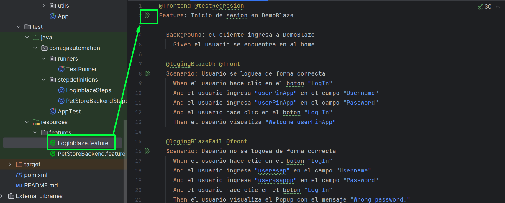
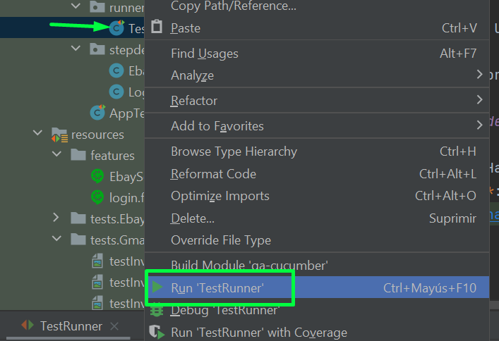
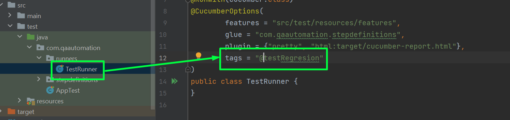

# PinApp Testing Project

Este es un proyecto técnico creado para **PinApp**, en el cual se utilizaron las plataformas de **BlaseDemo** para la generación de pruebas automatizadas, incluyendo pruebas de la API de **PetShop**.

## Librerías Utilizadas

El proyecto utiliza las siguientes librerías:

- **Java**: version del JDK 17

- **Selenium**: Utilizada para la automatización de pruebas en aplicaciones web, como la interacción con elementos en las páginas de Gmail y eBay.

- **RestAssured**: Utilizada para realizar pruebas automatizadas de APIs, específicamente para probar las funcionalidades de la API de PetShop.

- **TestNG**: Utilizado como framework de pruebas, que permite organizar y gestionar la ejecución de pruebas automatizadas, incluyendo la configuración de test suites.

- **Lombok**: Utilizado para simplificar el código Java mediante anotaciones que generan automáticamente métodos comunes como `getters`, `setters`, y constructores.

- **ExtentReports**: Utilizado para la generación de reportes detallados y visuales de los resultados de las pruebas automatizadas.

## Ejecución del Proyecto

**Feature**: Haciendo clic en los escenarios.

**TestRunner**: Haciendo clic secundario sobre el archivo y selecionado RUN, tener encuenta la configuracion interna para selecionar que tag se desea ejecutar

Tener encuenta el tag de ejecuion configurado
